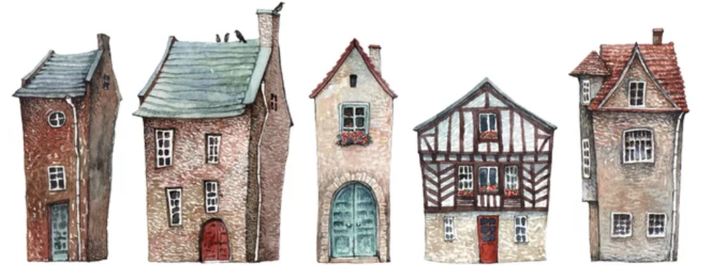
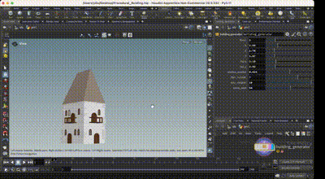
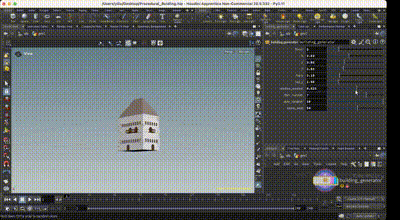

# Procedural Buildings

## Project Overview
This project presents a procedural building generator designed to create customizable multi-floor structures. The generator provides flexibility in architectural design by allowing control over key attributes such as:

- Number of floors
- Number and placement of windows and doors
- Height, width, and length of the building
- Dimensions of the roof
- Stone decorations and other architectural details

By adjusting these parameters, the generator creates diverse and unique building designs. This project was developed as part of the coursework for CIS5660, focusing on creating a procedural building generator with customizable features. This generator empowers the creation of multi-floor structures with highly adjustable architectural details, emphasizing flexibility and creativity in procedural content design.

## Features

- **Multi-Floor Generation**: Buildings are generated with procedurally stacked floors, offering customizable layouts and dimensions.
- **Customizable Windows and Doors**: The number, size, and style of windows and doors can be adjusted to fit various design requirements.
- **Dynamic Roof Adjustments**: The roof's height, width, and slope can be modified, allowing for diverse architectural profiles.
- **Stone Decorations**: Stone trims and decorative elements can be added, with customizable dimensions and placements to enhance visual appeal.
- **Interactive Parameters**: A user-friendly parameter interface enables adjustments to various features, encouraging experimentation with different designs.

## Setup and Planning

This project utilizes nodes from SideFX Labs. It is essential to install SideFX Labs from the "Labs/Packages" tab in the Houdini Launcher before starting. 

The design of the buildings draws inspiration from medieval-style watchtowers, known for their tall, narrow structures and intricate stonework. These elements serve as a strong foundation for procedural techniques and provide extensive opportunities for customization.

### Reference Art
The design is inspired by old European houses illustrated by Juliautumn.

## Development Process

The development process began with the creation of an HDA (Houdini Digital Asset) that stacks boxes procedurally to form the building's basic structure. The HDA includes parameters for controlling:

- Number of floors
- Height, width, and length of the building

The procedural stacking approach ensures consistency and flexibility in generating the core structure.

To enhance the aesthetic and functionality of the buildings, additional models for windows, doors, and balconies were created in Houdini. Each model includes a control node with adjustable parameters, allowing users to:

- Modify window and door dimensions
- Add and customize balconies

Decorative elements such as stone trims and adjustable roofs were also integrated, ensuring a cohesive architectural style.

## Demonstration

A video demonstration showcasing the procedural building generator in action is available to illustrate its capabilities.

## References

1. [Simon Houdini Procedural House Tutorial](https://www.youtube.com/watch?v=uIe97023sDk&t=979s&ab_channel=SimonHoudini)
2. [ISOBuilding Concept Art](https://www.behance.net/gallery/23773965/ISOBuilding-concept-art)

